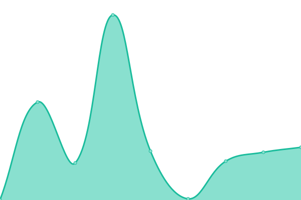
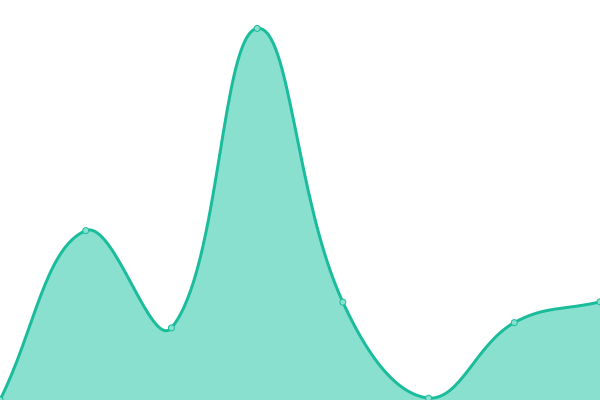
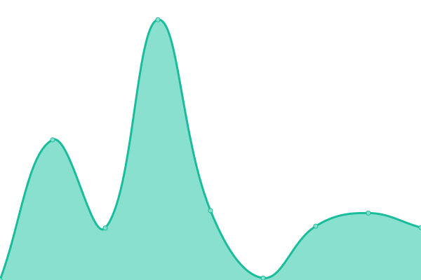
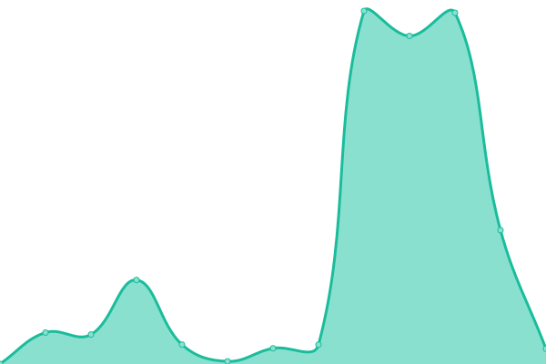
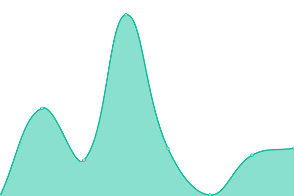
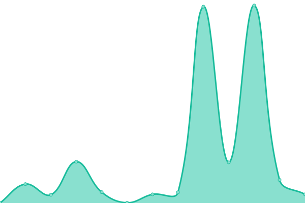

# [📈 Live Status](https://status.aosp.app): <!--live status--> **🟧 Partial outage**

This repository contains the open-source uptime monitor and status page for [AospApp](https://aosp.app), powered by [Upptime](https://github.com/upptime/upptime).

With [Upptime](https://upptime.js.org), you can get your own unlimited and free uptime monitor and status page, powered entirely by a GitHub repository. We use [Issues](https://github.com/aospapp/upptime/issues) as incident reports, [Actions](https://github.com/aospapp/upptime/actions) as uptime monitors, and [Pages](https://status.aosp.app) for the status page.

<!--start: status pages-->
<!-- This summary is generated by Upptime (https://github.com/upptime/upptime) -->
<!-- Do not edit this manually, your changes will be overwritten -->
<!-- prettier-ignore -->
| URL | Status | History | Response Time | Uptime |
| --- | ------ | ------- | ------------- | ------ |
|  [Main Site](https://aosp.app) | 🟩 Up | [main-site.yml](https://github.com/aospapp/upptime/commits/HEAD/history/main-site.yml) | 

 3578ms
     
 | 

<a href="https://status.aosp.app/history/main-site">100.00%</a>
    

|  [android-14.0.0_r1](https://aosp.app/android-14.0.0_r1) | 🟩 Up | [android-14-0-0-r1.yml](https://github.com/aospapp/upptime/commits/HEAD/history/android-14-0-0-r1.yml) | 

 3809ms
     
 | 

<a href="https://status.aosp.app/history/android-14-0-0-r1">92.53%</a>
    

|  [android-13.0.0_r1](https://aosp.app/android-13.0.0_r1) | 🟩 Up | [android-13-0-0-r1.yml](https://github.com/aospapp/upptime/commits/HEAD/history/android-13-0-0-r1.yml) | 

 1141ms
     
 | 

<a href="https://status.aosp.app/history/android-13-0-0-r1">98.04%</a>
    

|  [android-12.1.0_r1](https://aosp.app/android-12.1.0_r1) | 🟩 Up | [android-12-1-0-r1.yml](https://github.com/aospapp/upptime/commits/HEAD/history/android-12-1-0-r1.yml) | 

 1140ms
     
 | 

<a href="https://status.aosp.app/history/android-12-1-0-r1">100.00%</a>
    

|  [android-12.0.0_r1](https://aosp.app/android-12.0.0_r1) | 🟩 Up | [android-12-0-0-r1.yml](https://github.com/aospapp/upptime/commits/HEAD/history/android-12-0-0-r1.yml) | 

 776ms
     
 | 

<a href="https://status.aosp.app/history/android-12-0-0-r1">98.17%</a>
    

|  [android-11.0.0_r1](https://aosp.app/android-11.0.0_r1) | 🟩 Up | [android-11-0-0-r1.yml](https://github.com/aospapp/upptime/commits/HEAD/history/android-11-0-0-r1.yml) | 

 4333ms
     
 | 

<a href="https://status.aosp.app/history/android-11-0-0-r1">100.00%</a>
    

|  [android-10.0.0_r1](https://aosp.app/android-10.0.0_r1) | 🟩 Up | [android-10-0-0-r1.yml](https://github.com/aospapp/upptime/commits/HEAD/history/android-10-0-0-r1.yml) | 

 1151ms
     
 | 

<a href="https://status.aosp.app/history/android-10-0-0-r1">98.30%</a>
    

|  [android-9.0.0_r1](https://aosp.app/android-9.0.0_r1) | 🟩 Up | [android-9-0-0-r1.yml](https://github.com/aospapp/upptime/commits/HEAD/history/android-9-0-0-r1.yml) | 

 5467ms
     
 | 

<a href="https://status.aosp.app/history/android-9-0-0-r1">95.47%</a>
    

|  [android-8.1.0_r1](https://aosp.app/android-8.1.0_r1) | 🟩 Up | [android-8-1-0-r1.yml](https://github.com/aospapp/upptime/commits/HEAD/history/android-8-1-0-r1.yml) | 

 2772ms
     
 | 

<a href="https://status.aosp.app/history/android-8-1-0-r1">93.16%</a>
    

|  [android-8.0.0_r1](https://aosp.app/android-8.0.0_r1) | 🟥 Down | [android-8-0-0-r1.yml](https://github.com/aospapp/upptime/commits/HEAD/history/android-8-0-0-r1.yml) | 

 4203ms
     
 | 

<a href="https://status.aosp.app/history/android-8-0-0-r1">98.04%</a>
    

|  [android-7.1.0_r1](https://aosp.app/android-7.1.0_r1) | 🟩 Up | [android-7-1-0-r1.yml](https://github.com/aospapp/upptime/commits/HEAD/history/android-7-1-0-r1.yml) | 

 3601ms
     
 | 

<a href="https://status.aosp.app/history/android-7-1-0-r1">98.63%</a>
    

|  [android-7.0.0_r1](https://aosp.app/android-7.0.0_r1) | 🟩 Up | [android-7-0-0-r1.yml](https://github.com/aospapp/upptime/commits/HEAD/history/android-7-0-0-r1.yml) | 

 3879ms
     
 | 

<a href="https://status.aosp.app/history/android-7-0-0-r1">93.17%</a>
    

|  [android-6.0.0_r1](https://aosp.app/android-6.0.0_r1) | 🟩 Up | [android-6-0-0-r1.yml](https://github.com/aospapp/upptime/commits/HEAD/history/android-6-0-0-r1.yml) | 

 8847ms
     
 | 

<a href="https://status.aosp.app/history/android-6-0-0-r1">98.43%</a>
    

|  [android-5.1.0_r1](https://aosp.app/android-5.1.0_r1) | 🟩 Up | [android-5-1-0-r1.yml](https://github.com/aospapp/upptime/commits/HEAD/history/android-5-1-0-r1.yml) | 

 6163ms
     
 | 

<a href="https://status.aosp.app/history/android-5-1-0-r1">98.68%</a>
    

|  [android-5.0.0_r1](https://aosp.app/android-5.0.0_r1) | 🟩 Up | [android-5-0-0-r1.yml](https://github.com/aospapp/upptime/commits/HEAD/history/android-5-0-0-r1.yml) | 

 5382ms
     
 | 

<a href="https://status.aosp.app/history/android-5-0-0-r1">97.61%</a>
    

<!--end: status pages-->

[**Visit our status website →**](https://status.aosp.app)

## 📄 License

- Powered by: [Upptime](https://github.com/upptime/upptime)
- Code: [MIT](./LICENSE) © [AospApp](https://aosp.app)
- Data in the `./history` directory: [Open Database License](https://opendatacommons.org/licenses/odbl/1-0/)
